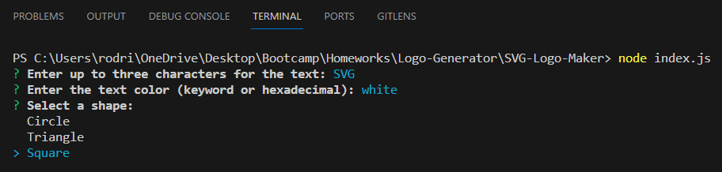

## SVG-Logo-Maker

# Description
This Node.js command-line application allows users to generate simple logos for their projects. It prompts users to input text, select colors, choose a shape, and then saves the generated SVG logo to a file.

# Features
- Input up to three characters for the logo text.
- Choose text color using a color keyword or hexadecimal number.
- Select a shape from the available options: circle, triangle, square.
- Choose a color for the selected shape.
- Save the generated logo as an SVG file.

# How to use
1. Clone the repository (https://github.com/rodrigoaoliva/SVG-Logo-Maker) to your local machine.
2. Navigate to the project directory.
3. Open the terminal and run the command: npm install inquirer@8.0.0
4. Run the command 'node index.js' in the terminal.
5. Follow the prompts to enter information about your logo, colors and shape.
6. Once the prompts are complete, the generated SVG file will be saved as "logo.svg" in the project directory.
7. Run the command 'start logo.svg' in the terminal to open the logo in the browser.

Video tutorial on how to use: https://drive.google.com/file/d/1LiK2oPx-880StR8OHkiBHu5vKJMWZ02L/view?usp=sharing

# License

This project is licensed under the MIT license.

# Questions
For questions about this project, contact https://github.com/rodrigoaoliva or email at rodrigoaoliva1@gmail.com
